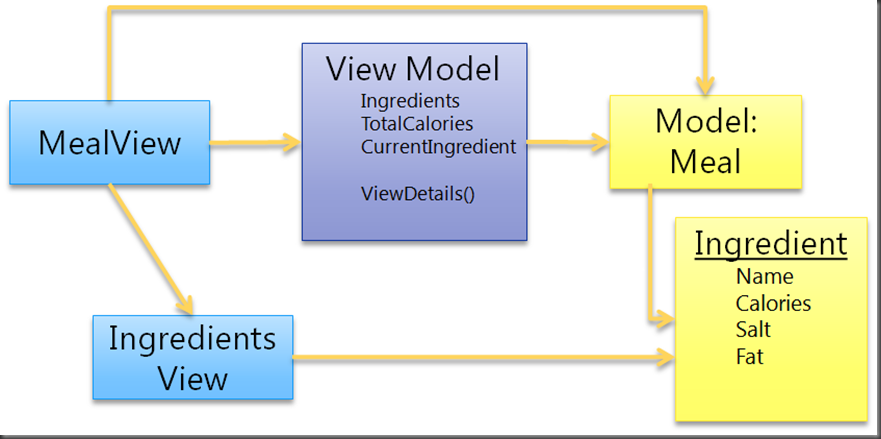
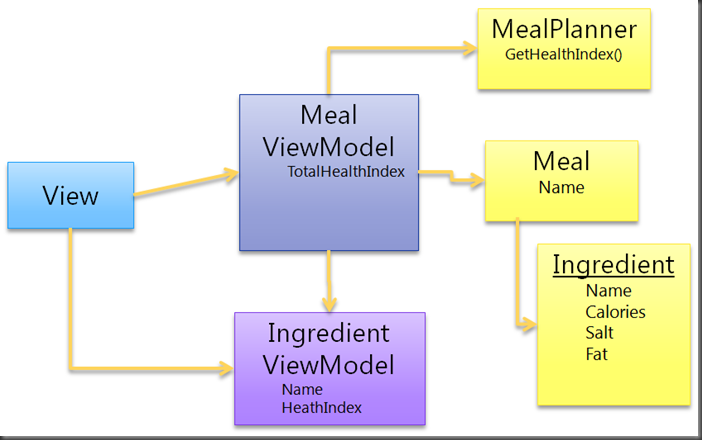
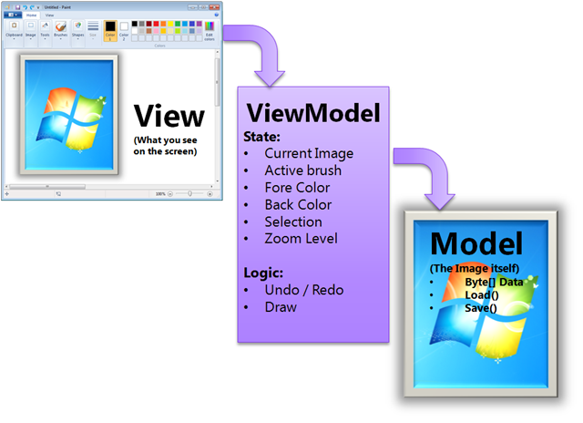
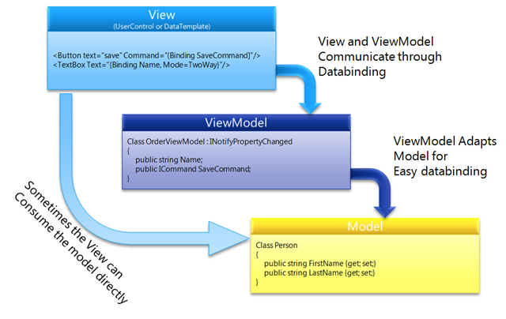

# MVVM - Erwin Van Der Valk's blog: Practicing patterns

[back](../README.md)

## How do I adapt a simple vs complex model

### What is that model thingy?

A model is more than just a POCO class that holds data. I view the collection of classes that solve a particular business problem. This can include:

- A business entity that stores the data.
- A Business component that holds business logic and operates on top of a business entity.
- Classes that retrieve or persist the data, for exmple repositories, services agents, etc.

The classic Model View Controller paradigm can be thought of as batch processing: The controller handles the input from the user and how to respond to that input. The view handles everything related to showing the output to the user. So the model encompasses the data and all the processing that is done with that data.

If you modeled your Model around your UI, then you have to change your Model when the UI changes. When you have designed you Model around the business logic, then your ViewModel can adapt the model to the process the user follows. Now of course there are tradeoff's. If you have very little business logic, and the UI is the only consumer of the business logic, then it might make more sense to design the model to more closely match what you see on the screen.

### Working with "easy to use" models

Sometimes, you have the fortune to get really easy to work with models. Easy to use models typically have the following characteristics:

- **They are easy to bind to** - They implements `INotifyPropertyChanged` for properties, `ICollectionNotifyPropertyChanged` for all collections of objects, and validations logic implementing `IDataErrorInfo`.
- **The model corresponds closely to what you see on the screen** - If the model is vey similar to the data on the UI.

So there are a couple of things you can do when you work with easy to bind models:

- **Consuming the model directly from the View** - If your Model exposes most of the data your view needs, then the view can directly consume the model.
- **Don't blindly create ViewModels for all of your view** - If you don't need one, because there is no Logic or UI state to hold, then don't create one.

### Working with "hard to use" models

A hard to wok with model has the following characteristics:

- The model does not easily map to waht you need in the UI. For example, the view needs to combine information from several models.
- It does not allow two-ways data binding.

## Implementing the Model view ViewModel pattern

### The ViewModel

So what is a ViewModel? And how does it differ from a View of the Model. Consider the following example. Suppose you would build Paint using WPF or Silverlight, using the MVVM pattern:

The View obviously determines what is displayed on the Screen. And the Model, well that will likely be the Image. But the application works with more date that 'just' the Document. This estra data is mostly the State of the UI. (kind of brush, zoom percentage) While it is possible to store this information in the View itself, this is usually a bad practice.

### Model for the View

The ViewModel is a model for the view. Therefore, it hold's all the state of the view as well as the logic that operates on the state. The ViewModel exposes this data and logic in such a way that the View can very easily access it. However, the ViewModel should not expose or interact directly with UI elements.

Another responsibility of the ViewModel is to adapt the Model to the View. Typically the model is a domain model. If you have full control over the model, then typically you can build it so that the model itself is very easily databindable. However, if you don't have control over the model, for example, you are getting it from an external system, them the ViewModel might need to adapt the model to the view.

### The MVVM pattern

So the following picture shows the MVVM pattern as how you would typically implement it in WPF or Silverlight:

The View is typically implemented as a UserControl or DateTemplate (in WPF). It uses DataBinding to read and update information of ht e ViewModel. If the vie needs to communicate to the ViewModel, there are several options:

- **Commands**: To route the Click event from a button to a ViewModel, the easiest way is to implement a Command. The _Command pattern_ describes an object that can invoke functionality at a later pint in time. In this case, when the user clicks a button.
- **2 way bindable properties**: You can use TwoWay databinding to notify the ViewModel that something has changed.
- **Bind ViewModel methods to events from controls**: The _Caliburn_ framework allows you to bind public methods on the ViewModel directly to your controls in XAML. Add complexity to the code.
- **Code behind**: It is always possible to use Code Behind to communicate between the View and the ViewModel.
- **ICommand interface**: A common way to expose functionality from your ViewModel that your View can interact with is by exposing _Command_ objects. A command object implements the _ICommand_ interface, that has two methods:
  - **Execute**, which will fire the logic encapsulated by the command.
  - **CanExecute**, which determines if the command can actually execute.
- **The INotifyPropertyChanged interface**: This interface allows your ViewModel to notify the View of changes to properties. One important thing: before invoking the event in the property, check if the value has actually changed. this helps preventing never ending loops when properties are chained together.

### What not to do in a ViewModel

- Expose or interact with visual elements in your ViewModel

  This ties your UI to Visual Elements and makes it hard to test in isolation.

- Try to control the View too directly from you ViewModel

  You should try to deep your ViewModel logical, rather than Visual. You can expose properties with the desire values or errors. Then the UI control designer can decide if the color of the control should be red or purple in a n error situation.

## Resources

- [How do I adapt a simple vs complex model](https://docs.microsoft.com/en-us/archive/blogs/erwinvandervalk/how-do-i-adapt-a-simple-vs-complex-model)
- [Implementing the Model View ViewModel pattern](https://docs.microsoft.com/en-us/archive/blogs/erwinvandervalk/implementing-the-model-view-viewmodel-pattern)

[back](../README.md)
