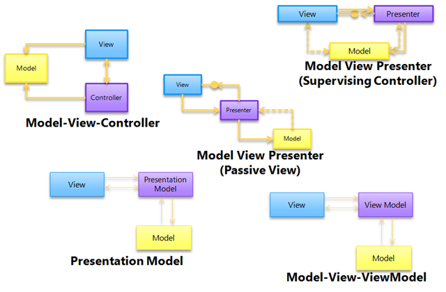
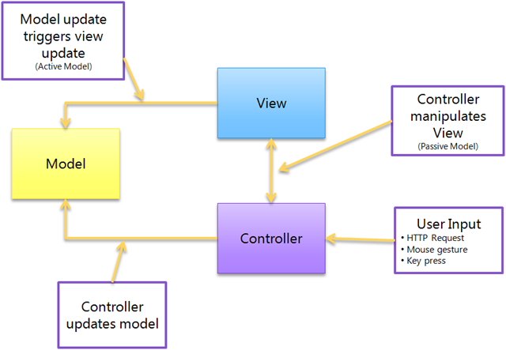
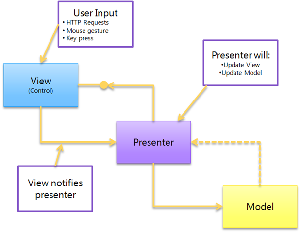
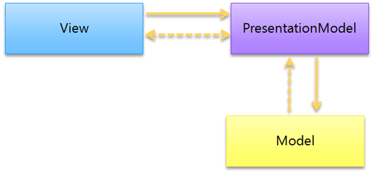
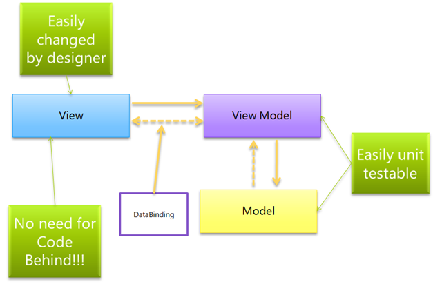

# MVVM - Erwin Van Der Valk's blog: Practicing patterns

[back](../README.md)

## How do I adapt a simple vs complex model

### What is that model thingy?

A model is more than just a POCO class that holds data. I view the collection of classes that solve a particular business problem. This can include:

- A business entity that stores the data.
- A Business component that holds business logic and operates on top of a business entity.
- Classes that retrieve or persist the data, for exmple repositories, services agents, etc.

The classic Model View Controller paradigm can be thought of as batch processing: The controller handles the input from the user and how to respond to that input. The view handles everything related to showing the output to the user. So the model encompasses the data and all the processing that is done with that data.

If you modeled your Model around your UI, then you have to change your Model when the UI changes. When you have designed you Model around the business logic, then your ViewModel can adapt the model to the process the user follows. Now of course there are tradeoff's. If you have very little business logic, and the UI is the only consumer of the business logic, then it might make more sense to design the model to more closely match what you see on the screen.

### Working with "easy to use" models

Sometimes, you have the fortune to get really easy to work with models. Easy to use models typically have the following characteristics:

- **They are easy to bind to** - They implements `INotifyPropertyChanged` for properties, `ICollectionNotifyPropertyChanged` for all collections of objects, and validations logic implementing `IDataErrorInfo`.
- **The model corresponds closely to what you see on the screen** - If the model is vey similar to the data on the UI.

So there are a couple of things you can do when you work with easy to bind models:

- **Consuming the model directly from the View** - If your Model exposes most of the data your view needs, then the view can directly consume the model.
- **Don't blindly create ViewModels for all of your view** - If you don't need one, because there is no Logic or UI state to hold, then don't create one.

### Working with "hard to use" models

A hard to wok with model has the following characteristics:

- The model does not easily map to waht you need in the UI. For example, the view needs to combine information from several models.
- It does not allow two-ways data binding.

## Implementing the Model view ViewModel pattern

### The ViewModel

So what is a ViewModel? And how does it differ from a View of the Model. Consider the following example. Suppose you would build Paint using WPF or Silverlight, using the MVVM pattern:

The View obviously determines what is displayed on the Screen. And the Model, well that will likely be the Image. But the application works with more date that 'just' the Document. This estra data is mostly the State of the UI. (kind of brush, zoom percentage) While it is possible to store this information in the View itself, this is usually a bad practice.

### Model for the View

The ViewModel is a model for the view. Therefore, it hold's all the state of the view as well as the logic that operates on the state. The ViewModel exposes this data and logic in such a way that the View can very easily access it. However, the ViewModel should not expose or interact directly with UI elements.

Another responsibility of the ViewModel is to adapt the Model to the View. Typically the model is a domain model. If you have full control over the model, then typically you can build it so that the model itself is very easily databindable. However, if you don't have control over the model, for example, you are getting it from an external system, them the ViewModel might need to adapt the model to the view.

### The MVVM pattern

So the following picture shows the MVVM pattern as how you would typically implement it in WPF or Silverlight:

The View is typically implemented as a UserControl or DateTemplate (in WPF). It uses DataBinding to read and update information of ht e ViewModel. If the vie needs to communicate to the ViewModel, there are several options:

- **Commands**: To route the Click event from a button to a ViewModel, the easiest way is to implement a Command. The _Command pattern_ describes an object that can invoke functionality at a later pint in time. In this case, when the user clicks a button.
- **2 way bindable properties**: You can use TwoWay databinding to notify the ViewModel that something has changed.
- **Bind ViewModel methods to events from controls**: The _Caliburn_ framework allows you to bind public methods on the ViewModel directly to your controls in XAML. Add complexity to the code.
- **Code behind**: It is always possible to use Code Behind to communicate between the View and the ViewModel.
- **ICommand interface**: A common way to expose functionality from your ViewModel that your View can interact with is by exposing _Command_ objects. A command object implements the _ICommand_ interface, that has two methods:
  - **Execute**, which will fire the logic encapsulated by the command.
  - **CanExecute**, which determines if the command can actually execute.
- **The INotifyPropertyChanged interface**: This interface allows your ViewModel to notify the View of changes to properties. One important thing: before invoking the event in the property, check if the value has actually changed. this helps preventing never ending loops when properties are chained together.

### What not to do in a ViewModel

- Expose or interact with visual elements in your ViewModel

  This ties your UI to Visual Elements and makes it hard to test in isolation.

- Try to control the View too directly from you ViewModel

  You should try to deep your ViewModel logical, rather than Visual. You can expose properties with the desire values or errors. Then the UI control designer can decide if the color of the control should be red or purple in a n error situation.

## The difference between Model-View-ViewModel and other separated presentation patterns

There are quite a number of Separated Presentation patterns out there. Model View Controller, Model View Presenter, Presentation Model, Passive View, Supervising Controller, Model View ViewModel and many many more:

### Building an UI without Separated presentation patterns

How would you build a UI without using a separated presentation patten. Typically, you'd create a form or user control, drag your controls on it and put the logic in the code behind. The code in the Code behind is very closely coupled to the UI, because it directly interacts with the controls on the screen. So the form or user control holds both the code to draw the UI, the logic of the UI and the data of the UI, you'll run into the following problems:

- Decreased maintainability
- Decreased Testability
- Decreased Reusability

### The goals of separated presentation patterns

Separate UI related code (Views) from logic related code (Presenters, controllers, ViewModels, etx...) and from th Date (Models). This allows each of these to evolve independently. Secondly because the Logic and Date is separated from the visualization, the logic and the data ca be uit tested in isolation.

### Model View Controller pattern

This pattern was developed for building Smalltalk applications. But in those days (~=1979), computer programming was a bit different than today. There was no Windows. No graphical user interface. No Controls library. If you wanted a UI, you had to draw it yourself. The same with the user interactions through input devices such as keyboards.

Where everybody wea mixing the visualization code, User interaction code, logic and data together, _Trygne Reenskaug_ came up with a pattern to separate these into separate classes, each with a distinct responsibility.

- **Model**: typically is the data of your application and the logic to retrieve and persist that data. Often, this is a domain model that can be based on a database or the results from web services.
- **View**: was responsible for drawing the UI on the screen. without windows or controls, that meant drawing, boxes, buttons, input fields, etx on the screen.
- **Controller**: is responsible for handling the User Input and then updating the Model or the View.

The ASP.NET MVC framework does not use the concept of controls in the same way as teh normal ASP.NET framework does. In the ASP.NET MVC framework, a View is an ASPX control that renders HTML. And the controller again handles the user gestures, because it receives the HTTP requests. Based on the http request, it determines what to do( update a model or display a particular view).

### Model View Presenter pattern

The concept of a _control_ emerged. A Control encapsulates both the visualization (It draws itself), but also the user interaction. This reduces the need for a controller, so the Model View Controller pattern became less relevant. However, since there was still a need for separating out the logic of the application from the Controls adn the data, an other pattern called Model View Presenter became more popular.

The Model View Presenter pattern describes a way to separate out the visual elements (Controls) from the Logic (What happens when you interact with the controls) and the Date (hat data is displayed in the view).

- **Model**: It is the same as before.
- **View**: is typically a user control or form that combines several into a user interface. The user can interact with the conrols in the View, but when some logic needs to be started, the view will delegate this to the presenter.
- **Presenter**: it holds all the logic for the view and is responsible for synchronizing the model and the View.

One important thing to mention is that the Presenter doesn't communicate directly to the View. Instead, it communicates through an interface.

There are two variations of this pattern, Passive View and Supervising Controller

#### Passive View

The View knows nothing about the model, but instead exposes simple properties for all the information it wants to display on the screen. The presenter will read information from the Model and update the properties from the model. This requires quite a lot of coding, both for the View but also for the Presenter. However, it will make the interaction between the View and the Presenter more testable.

#### Supervising Controller

The View DOES know about the Model and is responsible for databinding the Model to the View. This makes the interaction between the Presenter and the View a lot less chatty, but ar the expense of testability of the View-Presenter interaction. Their interfaces are less granular and puts more responsibilities in the View.

### Presentation Model

Martin Fowler describes a different approach on achieving separation of concerns on his site, that's called Presentation Model. It is a logical representation of User Interface, without relying on any visual elements.

The presentation model has several responsibilities:

1. **Hold the logic of the UI**: When you click a button, that click is forwarded to the Presentation Model, which then decides what to do with it.
1. **Massage the data from the model to be displayed on the screen**: The Presentation Model can convert the data in the model so it can more easily be displayed on the screen.
1. **Store the state of the UI**: Often, the UI needs to store additional information that has nothing to do with the domain model. The Presentation model can store this information in properties.

The View can then easily read the information from the Presentation Model and get all the information it needs to display the view.

### Model View ViewModel

It looks surprisingly similar to the Presentation Model pattern

In fact, the pretty much the only difference is the explicit use of the databinding capabilities of WPF and Silverlight. The ViewModel doesn't communicates directly with the View. Instead it exposes easily bindable properties and methods (in the form of Commands). The View can databinding those properties and commands to query information from the ViewModel and call methods on the ViewModel. It's also not required that the View knows about the ViewModel. XAML Databinding uses a form of reflection to bind properties of the ViewModel, so theoretically you can use any ViewModel with the View that exposes the right properties.

- You get a fully testable logical model of your application.
- Because the ViewModel offers everything the view needs in easily consumed format, the view itself can be fairly simple.
- Lastly, you can avoid using code behind.

## Resources

- [How do I adapt a simple vs complex model](https://docs.microsoft.com/en-us/archive/blogs/erwinvandervalk/how-do-i-adapt-a-simple-vs-complex-model)
- [Implementing the Model View ViewModel pattern](https://docs.microsoft.com/en-us/archive/blogs/erwinvandervalk/implementing-the-model-view-viewmodel-pattern)
- [The difference between Model-View-ViewModel and other separated presentation patterns](https://docs.microsoft.com/en-us/archive/blogs/erwinvandervalk/the-difference-between-model-view-viewmodel-and-other-separated-presentation-patterns)
- [How od i do... With the Model View ViewModel pattern](https://docs.microsoft.com/en-us/archive/blogs/erwinvandervalk/how-do-i-do-with-the-model-view-viewmodel-pattern)

[back](../README.md)
