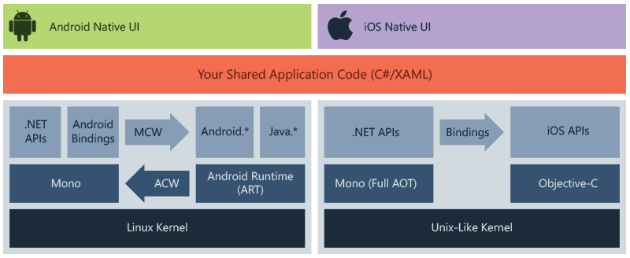

# Xamarin

[back](../README.md)

Xamarin is an open-source platform for building modern and performant applications for IOS, Android, and Windows with .NET. Xamarin is an abstraction layer that manages communication of shared code with underlying platform code.

Xamarin enables developers to share an average of 90% of their applications across platforms.

## Who Xamarin is for

It is for developers with the following goals:

- Share code, test and business logic across platform
- Write cross-platform applications in C# with Visual Studio.

## How Xamarin works



The diagram shows the overall architecture of a cross-platform Xamarin application. Xamarin allows you to create a native UI ono each platform and write business logic in C# that is shared across platforms. In most cases, 80% of application code is sharable using Xamarin.

Xamarin is built on top of .NET, which automatically handles tasks such as memory allocation, garbage collection and interoperability with underlying platforms.

## Added features

Xamarin combines the abilities of native platforms, while adding features that include:

1. **Complete binding for the underlying SDK s**: These bindings are strongly-typed, which means that they're easy to navigate and use, and provide robust compile-time type checking and during development. Strongly-typed bindings lead to fewer runtime errors and higher-quality applications.
1. **Objective-C, Java, C, and C++ Interop**: Xamarin provides facilities for directly invoking Objective-C, Java, C, and C++ libraries, giving you the power to use a wide array of third party code.
1. **Modern language constructs**: Xamarin is written in C#, a modern language that includes significant improvements over Objective-C and Java such as dynamic language features, functional constructs such as lambdas, LINQ, parallel programming, generics, and more.
1. **Robust Base Class Library (BCL)**: Xamarin applications use the .NET BCL, a large collection of classes that have comprehensive and streamlined features such as powerful XML, Database, Serialization, IO, String, and Networking support and more.
1. **Modern Integrated Development Environment (IDE)**: Xamarin uses Visual Studio
1. **Mobile cross-platform support**: Xamarin offers sophisticated cross-platform support for the three major platforms of iOS, Android, and Windows. Applications can be written to share 90% of their code, and Xamarin.Essentials offers a unified API to access common resources across all three platforms. Shared code can significantly reduce both development costs and time to market for mobile developers.

## Xamarin.Android

Xamarin.Android exposes the complete Android SDK for .NET developers. Build fully native Android apps using C# or F# in Visual Studio.

You can found the steps to [Install](https://docs.microsoft.com/en-us/xamarin/android/get-started/installation/) and a [QuickStart](https://docs.microsoft.com/en-us/xamarin/android/get-started/hello-android/hello-android-quickstart?pivots=windows) into the documentation.

### Fundamentals

This guide will touch upon the following topics:

- Anatomy of a Xamarin.Android Application
- App Fundamentals and Architecture Basics
- User Interfaces
- Activities and the Activity Lifecycle

#### Anatomy of a Xamarin.Android Application


- Properties - Contains the AndroidManifest.xml file that describes all of the requirements for the Xamarin.Android application, also houses AssemblyInfo.cs, a .NET assembly metadata file.
- References - Contains the assemblies required to build and run the application.
- Assets - Contains the files the application needs to run including fonts, local data files, and text files. Files included here are accessible through the generated `Assets` class.
- Resources - Contains application resources such as string, images, layouts. You can access these resources in code through the generated `Resource` class.
  - drawable - this directory houses drawable resources such as images and bitmaps.
  - mipmap - this directory holds drawable files for different launcher icon densities.
  - layout - this directory contains _Android designer files_ (.axml) that define the user interface for each screen or Activity. Default created template `activity_main.axml`.
  - values - this directory houses XML files that store simple values such as strings, integers, and colors.
  - Resource.designer.cs - AKA `Resource` class, this file is a partial class that holds the unique IDs assigned to each resource. This file should not be manually edited, as Xamarin.Android will overwrite any manual changes made to it.

#### App Fundamentals and Architecture Basics

This section only cover the most common entry point for an Android app: the first screen.

Activity is a special Android class that corresponds to a single application screen, and it is responsible for drawing and powering the user interface. When Android creates an application's first Activity, it's load the entire application.


Since there is no linear progression through an Android application (you can launch the application from several points), Android has a unique way of keeping track of what classes and files make up an application. The Android Manifest file register all the parts that make up the application. The role of the Android Manifest is to keep track of an application's contents, properties, and permissions and to disclose them to the Android operating system.


#### User Interface

`activity_main.axml` is the user interface layout file for the first screen in the application. The `.axml` indicates that this is an Android designer file (AXML stands for Android XML). The name of Main is arbitrary from Android's point of view.

#### Activities and the Activity Lifecycle

The `Activity` class contains the code that powers the user interface. The `Activity` is responsible for responding to user interaction and creating a dynamic user experience.

##### Activity Class

The class that powers the screen is called `MainActivity` and lives in the `MainActivity.cs` file. The name `MainActivity` hos no special in Android. When you open `MainActivity.cs`, you can see that the `MainActivity` class is a _subclass_ of the `AppCompatActivity` class, and that the Activity is adorned with the **Activity** attribute:

```cs
[Activity (Label = "App", MainLauncher = true)]
public class MainActivity : AppCompatActivity { ... }
```

The Activity Attribute registers teh Activity with the **Android Manifest**; this lets Android know that this class is part of the current application managed by this manifest. The _Label_ property sets the text that will be displayed at the top of the screen. The _MainLauncher_ property tells Android to display this Activity when the application starts up. This property becomes important as you add more Activities (screens) to the application.

> Note: Some guides use `Activity` rather than `AppCompatActivity`. Here is the difference:
>
> `Activity`: it let you code very easy, but you need to code it for every new Android version.
>
> `AppCompatActivity`: it is more difficult to code, but once coded it'll support all higher version of Android.

##### Activity Lifecycle

Activities can be created, started and paused, resumed and destroyed, and so on. The `Activity` class contains methods that the system calls at certain points in the screen's lifecycle.


By overriding `Activity` lifecycle methods, you can control how the Activity loads, how it reacts to the user, and even what happens after it disappears from the device screen.

- **OnCreate** - Creates views, initializes variables, and performs other prep work that must be done before the user sees the Activity. This method is called only once when the Activity is loaded into memory.
- **OnResume** - Performs any task that must happen every time the Activity returns to the device screen.
- **OnPause** - Performs any tasks that must happen every time the Activity leaves the device screen.

When you add custom code to a lifecycle method in the Activity, you _override_ that lifecycle method's _base implementation_. You must call the base implementation from inside your method to ensure that the original code runs before your new code.

```cs
protected override void OnCreate(Bundle bundle)
{
  base.OnCreate(bundle);
  // New code
}
```

To respond to User interaction you can use lambda expressions, but a delegate or a named event handler could be used instead.

```cs
someButton.Click += (sender, e) => {
  // Some Action
}
```


##### Android Application Building Blocks

An Android application consist of a collection of special Android classes called Application Blocks bundled together with any number of app resources - images, themes, helper classes, etc. these are coordinated by an CML file called the Android Manifest.

Application Block form the backbone of Android Applications because they allow toy to do things you couldn't normally accomplish with a regular class. The two most important ones are:

- **Activity** - It corresponds to a screen with a user interface, and it is conceptually similar to a web page in a web application.
- **Service** - It support Activities by taking over long-running tasks and running them in background. Services don't have a user interface and are used to handle tasks that aren't tied to screens.

An Android application may not use all types of Clock, and often as several Blocks of one type.

##### Intents

Another fundamental concept in Android applications is the _Intent_. Android is designed around the _principle of least privilege_ - applications have access only to the Blocks they require to work, and they have limited access to the Clocks that make up the operating system or other applications. Similarly, Blocks are loosely-coupled - They are designed to have little knowledge of and limited access to other Block (even block that are part of the same application).

To communicate, Application Blocks send asynchronous messages called \*Intents\*\* back and forth. Intents contains information about the receiving Block and sometimes some data. An Intent sent from one App component triggers something to happen in another App component, binging the two App components and allowing them to communicate. By sending Intents back and forth, you can get Clocks to coordinate complex actions such as launching the camera app to take and save, gathering location information, or navigating from one screen to the next.

##### AndroidManifest.XML

When you add a Block to the application, it is registered with a special XML file called the **Android Manifest**. The Manifest keeps track of All Applications Blocks in an application, as well as version requirements, permissions, and linked libraries - everything that the operating system needs to know for your application to run. **Android Manifest** also works with Activities and Intents to control what actions are appropriate for a given Activity.

##### Android navigation

Intents were used to navigate between screens. Start by creating an Intent, passing in the current Context (`this`,referring to the current **Context**) and the type of Application Block that you're looking for (SomeActivity):

```cs
Intent intent = new Intent(this, typeof(SomeActivity));
```

The **Context** is an interface to global information about the application environment - it lets newly-created objects know what's going on with the application - If you thing of an Intent as a message, you are providing the name of the message recipient (`SomeActivity`) and the receiver's address (`Context`).

Android provides an option to attach simple date to an Intent (complex data is handled differently).

```cs
translationButton.Click += (sender, e) => {
  var intent = new Intent(this, typeof(SomeActivity));
  intent.PutStringArrayListExtra("data", data);
  StartActivity(intent);
}
```

##### Additional concepts

- **String Resources** - The `@string` syntax means that the string's value is stored in the string resource file, **String.xml**.

- **ListView and ArrayAdapter** - A ListView is a UI component that provides a simple way to present s scrolling list of rows. A `ListView` instance requires an Adapter to feed it with data contained in row views.

## Xamarin.iOS

## Xamarin.Essentials

Xamarin.Essentials provides developers with cross-platform APIs for their mobile applications.

Android. iOS, and UWP offer unique operating system and platform APIs that developers have access to all in C# leveraging Xamarin.

### Features Guide

- Accelerometer - Retrieves acceleration data of the device in three dimensional space.
- App Actions - Get and set shortcuts for the application.
- App Information - Find out information about the application.
- App Theme - Detect the current theme requested for the application.
- Barometer - Monitor the barometer for pressure changes.
- Battery - Easily detect battery level, source, and state.
- Clipboard - Quickly and easily set or read text on the clipboard.
- Color Converters - Helper methods for System.Drawing.Color.
- Compass - Monitor the compass for changes. Monitor the device's magnetic north heading.
- Connectivity - Check connectivity state and detect changes.
- Contacts - Retrieve information about a contact on the device.
- Detect Shake - Detect a shake movement of the device.
- Device Display Information - Get the device's screen metrics and orientation.
- Email - Easily send email messages.
- File Picker - Allow user to pick files from the device.
- File System Helpers - Easily save files to app data.
- Flashlight - A simple way to turn the flashlight on/off.
- Geocoding - Geocode and reverse geocode addresses and coordinates. API to geocode a placemark to a positional coordinates and reverse.
- Geolocation - Retrieve the device's GPS location.
- Gyroscope - Track rotation around the device's three primary axes.
- Haptic Feedback - Control click and long press haptic.
- Launcher - Enables an application to open a URI y the system.
- Magnetometer - Detect device's orientation relative to Earth's magnetic field.
- MainThread - Run code on the application's main thread.
- Maps - Open the maps application to a specific location.
- Media Picker - Allow user to pick or take photos and videos.
- Open Browser - Quickly and easily open a browser to a specific website.
- Orientation Sensor - Retrieve the orientation of the device in three dimensional spaces.
- Permissions - Check and request permissions from users.
- Phone Dialer - Open the phone dialer.
- Platform Extensions - Helper methods for converting Rect, Size, and Point.
- Preferences - Quickly and easily add persistent preferences.
- Screenshot - Take a capture of the current display of the application.
- Secure Storage - Securely storage data.
- Share - Send text and website links to other apps.
- SMS - Create an SMS message fr sending.
- Text-to-Speech - Vocalize text on the device.
- Unit Converters - Helper methods to convert units.
- Version Tracking - Track the applications version and build numbers.
- Vibrate - Make the device vibrate.
- Web Authenticator - Start web authentication flows and listen for a callback.

### Installation

Xamarin.Essentials is available as a NuGet package and is included in every new project in Visual Studio.

### Platform Support

Xamarin.Essentials support the following platforms and operating systems:

| Platform | Version                    |
| -------- | -------------------------- |
| Android  | 4.4 (API 19) or higher     |
| iOS      | 10.0 or higher             |
| Tizen    | 4.0 or higher              |
| tvOS     | 10.0 or higher             |
| watchOS  | 4.0 or higher              |
| UWP      | 10.0.16299.0 or higher     |
| macOS    | 10.12.6 (Sierra) or higher |

## Xamarin.Forms

[back](../README.md)
